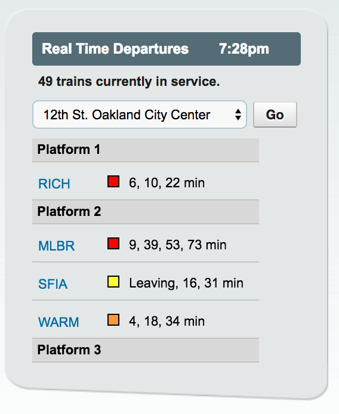

## HOMEWORK 10: MORE PRACTICE WITH LOOPS
> * Due date: Midnight on Wednesday, 11/15 (2 weeks)
> * Part I: Setting up your new homework branch
> * Part II: Browsing the documentation
> * Part III: Coding
> * Part IV: Submit

## Part I: GitHub Setup
1. Using the Terminal, navigate to your mmart-168-fall2017 git repository: `$ cd {your git repository path} #different for everyone`
2. Check out the master branch: `$ git checkout master`
3. Pull the most recent changes from the upstream repository: `$ git pull --rebase upstream master`
4. Create a new branch to do Homework 10: `$ git branch homework10`
5. Checkout your new homework10 branch: `$ git checkout homework10`
6. Verify that you are now on the new branch: `$ git branch` (check that your new homework10 branch has an asterisk next to it).

## Part II: Browsing the BART API Documentation
Open the BART API Documentation, and take a look at the kinds of information the API
offers: https://api.bart.gov/docs/overview/examples.aspx. Consider the following:
* What kind of information does this API make available?
* What apps and websites do you think access this information?
* Exercise (not to turn in): Open the following URL in your web browser: 
  https://api.bart.gov/api/sched.aspx?cmd=depart&orig=24th&dest=rock&key=MW9S-E7SL-26DU-VV8V&json=y
    * What happens when you change the "orig" and "dest" parameters (see [this list](https://api.bart.gov/docs/overview/abbrev.aspx))?
    * What happens when you remove the "json=y" section of the URL?

## PART III: Coding
Please complete the following activities
### A. Building the Station List Menu
Using any loop you want, modify the ***makeStationList*** function so that it populates the select menu with *ALL* of the stations that are returned from the BART data feed: https://api.bart.gov/api/stn.aspx?cmd=stns&key=MW9S-E7SL-26DU-VV8V&json=y

### B. Create a Train Arrival Display
1. Update the ***getArrivalTimes*** function so that it queries whatever station the user selects.
2. Instead of printing all of the train arrival estimates to the console, output the following information to the DOM for each train:
    * time of arrival
    * direction
    * whether or not there is a delay
    * whether or not bikes are allowed
    * which platform
    * the color of the train line

### C. Extra Credit Opportunities
Make the information display look similar to the screenshot below (similar to how BART does it) using CSS (up to 40 points)

## Part IV: Submit
1. Just as in Part II, open your Terminal and type: `$ git status`. It should tell you which files you've changed.
2. To "commit" all of your changes, type: ` $ git commit -am 'Completed homework 10'`
3. To "push" your change to up to your github account, type: `$ git push --set-upstream origin homework10`
4. Finally, verify that your changes are up on GitHub by logging into your GitHub account and taking a look at your newly created homework10 branch.
5. **Submit your homework by pasting a link to your branch into the Moodle.**
